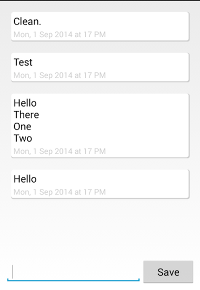

##Overview
Plog (pronounced like blog), is an app to do self tweet. This is useful for
keeping notes and later finding historical information.

##Technology Used

###MVC Separation
Code is separated out in Model, View and Controller. The model layer
is mostly asynchronous.

###Schema Version Management
The DBHelper class extends SQLiteOpenHelper and takes care of
schema creation and version management. The PlogApplication class
kicks of schema creation by calling getWritableDatabase() of the helper class.

###SQLite3 Full Text Search
We are using FTS3 extension of SQLite to do fast text search. See
how the LogEntryText table is created in the DBHelper class.

###Custom ListView Adapter
Almost all non-trival application using ListView will need to create its
own UI for the cells. We do that here.

###Swipe to Delete Row in ListView
To delete a log entry, user needs to swipe the row to the right. We use
animation to make it look pretty.
